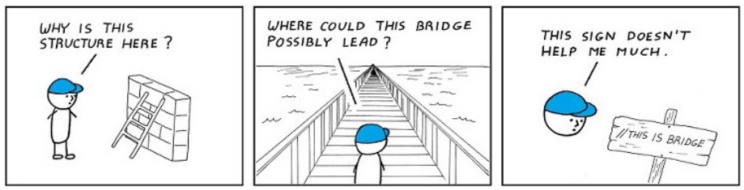
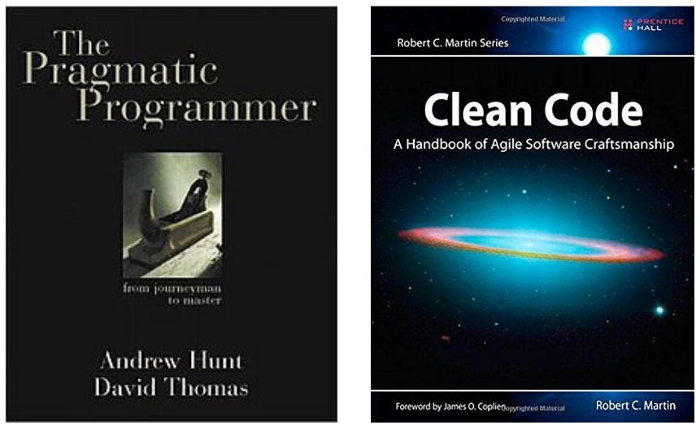

# Namenskonventionen und sauberer Code

*There are 2 hard **Probleme** in computer science: **cache invalidation**, **naming Dinge**, and **off-by-1 errors**.*

In diesem Kapitel widmen wir uns der Benennung von Variablen, Methoden, Klassen, Objekten usw. und dem Schreiben von sauberem Code. Dieses Kapitel soll eine Einführung in dieses Thema darstellen. Weitere Informationen findest du unter der weiterführenden Litteratur.

## Warum ist dies überhaupt ein wichtiges Thema?

Stelle dir vor, du übernimmst das Programm eines\*r Arbeitskollegen\*in und du sollst einen Fehler darin suchen. Was machst du als Erstes?

Du versuchst, zu verstehen, was der Quellcode überhaupt tut!

### Schlechtes Beispiel

Und jetzt stellst du dir vor, der Code schaut folgendermaßen aus, um eines unserer letzter Beispiele heranzuziehen:

#### Java 

```Java
public static void main(String[] args) {
    Scanner s = new Scanner(System.in);
    int n = s.nextInt();
    Ch ch = new Ch();

    System.out.print(n);

    for (int i = 0; i <= n; i++){ 
        System.out.println(ch.En(i));
    }
}
```

#### C#

```c#

```

Was kannst du aufgrund des Quellcodes erkennen? Was macht dieses Programm?

An sich kann selbst ein\*e sehr erfahrene\*r Softwareentwickler\*in nicht wahnsinnig viel sagen, höchstens, was die einzelnen Befehle bedeuten, aber was soll das Programm konkret tun soll, ist hier nicht ermittelbar. 

Was soll ***n*** darstellen? Wir wissen nur, dass es das Ergebnis der Eingabe ist und, dass es die höchste Zahl ist, die i annehmen darf, aber mehr können wir nicht sagen. 

Was ist ein ***Ch*** zum Beispiel? Was macht die Methode ***ch.En(i)***? Diese Fragen können wir so nicht beantworten. 

Hier würden wir unbedingt Kommentare benötigen, um den Code vollständig zu verstehen. Weiters, je länger der Code wird, desto schwieriger wird es, sich daran zu erinnern, was welche Variable genau bedeutet.

### gutes Beispiel

Im Gegensatz dazu könnten gut benannte Elemente so aussehen:

#### Java 

```Java
public static void main(String[] args) {
    Scanner scanner = new Scanner(System.in);
    int maxNumber = s.nextInt();
    Check check = new Check();

    System.out.print("Wir drucken für alle Zahlen von 0 bis " + maxNumber + ", ob diese gerade sind");

    for (int i = 0; i <= maxNumber; i++){ 
        System.out.println("Ist die Zahl " + i " gerade? " + check.isEvenNumber(i));
    }
}
```

#### C#

```c#

```

Ein solcher Quellcode ist für andere viel leichter verständlich. 

Erstens bekommt der\*die Benutzer\*in mehr Informationen und diese helfen dem\*der Entwickler\*in, den Sinn des Codes zu erfassen.

Weiters erkennen wir jetzt: 

Die Eingabe soll die höchste Zahl von etwas sein.

Das vorige ***Ch*** soll eine Klasse ***Check*** sein, also wirds hier um Prüfungen gehen. 

Der Aufruf ***check.isEvenNumber(i)*** ist auch eindeutig: Hier wird geprüft, ob die übergebene Zahl gerade ist. 

Du wirst sagen: Warum ist ***i*** nicht eindeutiger benannt worden? 

In der Softwareentwicklung haben sich spezielle Variablennamen eingebürgert, die jede\*r Entwickler\*in versteht. ***i*** im Rahmen einer Schleife ist eines davon und soll heißen: **Iterator**. Sind mehrere Schleifen ineinander verschachtelt, ist es üblich auch j usw. zu verwenden. 

## Kommentare



Dieses Bild verdeutlich sehr gut die Bedürfnisse von anderen Entwicklern\*innen, wenn sie sich einen fremden Code anschauen. 

1. es macht wenig Sinn jede einzelne Zeile des Codes zu kommentieren, daher nur dort, wo es sinnvoll ist.
1. Kommentare sollen einen Mehrwert bringen. Also sagt ein Kommentar genau das aus, was man bereit aus der Zeile Code herauslesen konnte, muss überlegt werden: brauche ich hier einen Kommentar? Und wenn ja, was bringt meinen "Lesern" einen Mehrwert?
1. Beschreibe also, wozu die Variable, der Codeteil hier ist? Was soll sie/er lösen? 
1. besser als Kommentare sind aber aussagekräftige Variablen- bzw. Methodennamen

## Grundregeln für die Benennung von Variablen, Methoden, Klassen, ...

### allgemeine Regeln

1. Der Name soll **aussagekräftig**, aber denke daran! Diesen Namen wirst du auch öfters schreiben müssen, also fasse dich dennoch nur so **lang** wie nötig.
1. Wähle eine Sprache und bleibe dabei! Meist wird englisch verwendet, tue es aber nur, wenn du dich mit englisch wohl fühlst. ACHTUNG! Die Coding-Guidelines deiner Firma können dir auch vorschreiben, Namen in englisch zu schreiben!
1. Wo es möglich ist, verwende **aussagekräftige Konstantennamen**, statt dem Wert der Konstante.
1. keine redundanten Informationen
1. Ein Wort pro Konzept: get, fetch, find, ... Entscheide dich für eines und bleibe dabei.
1. keine reservierten Wörter: in jeder Programmiersprache gibt es bestimmte Schlüsselwörter, die eine bestimmte "Funktionalität" haben. Diese dürfen nicht "überschrieben" werden. (Siehe Schrödinger-Buch)
1. Verwende Wörter, die ihrem Namen treu bleiben: Controller, Queue, Repository, ...

### Methoden

Im Methodenname, solltest du einen **Verb** verwenden: eine Methode stellt eine Aktion dar, daher ist ein Verb, der diese Aktion darstellt, sinnvoll.

**Beispiele**: deleteAccount(...), addToBasket(...), cleanUp(), ...

### Klassen

Im Klassennamen solltest du einen **Nomen** verwenden: eine Klasse beschreibt, welche Eigenschaften und Methoden ein Element haben soll. Daher beschreibt ein Nomen am besten.

**Beispiele**: AccountValidator, BasketController, Calculator, ...

## Namenskonventionen

Je nach Programmiersprache weichen die Namenskonventionen, dennoch solltet ihr folgende kennen:
1. **camelCase**: beginnt mit einem Kleinbuchstaben. Danach beginnt jedes weitere Wort mit einem Großbuchtaben. camelCase beinhaltet keine - oder _ zwischen den Wörtern!
1. **PascalCase**: jedes Wort beginnt mit einem Großbuchstaben. Auch hier werden keine - bzw. _ zwischen den Wörtern verwendet.
1. **SNAKE_CASE**: bei snake_case werden Wörter mit einem unterstrich "_" voneinander getrennt. Hier aber nicht definiert, ob alle Buchstaben groß- oder kleingeschrieben werden.
1. **Kebab-Case**: ähnlich wie bei snake_case, allerdings wird ein Bindestrich "-" als Trennzeichen verwendet.

### Java

In Java sind folgende Konventionen in Gebrauch:

- Klassen: PascalCase
- Variablen & Methoden: camelCase
- Konstanten: SNAKE_CASE, wobei alle Buchstaben groß geschrieben werden

Näheres [hier](https://de.wikipedia.org/wiki/Namenskonvention_(Datenverarbeitung))

### C#

In C# werden folgende [Konventionen von Microsoft](https://learn.microsoft.com/de-de/dotnet/csharp/fundamentals/coding-style/identifier-names) beschrieben:

- Klassen- & Methodennamen & öffentliche Member: PascalCase
- Methodenargumente, lokale Variablen und private Felder: camelCase
- Konstanten: PascalCase

## weiterführende Litteratur

